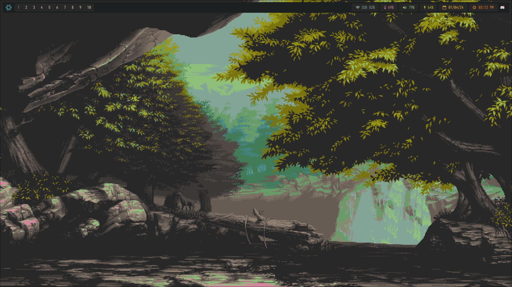
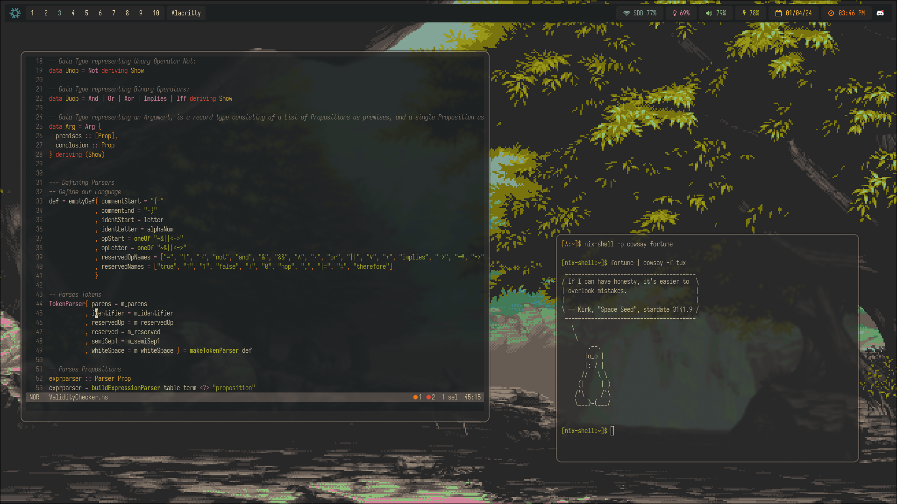

## NixOS Dotfiles
The configuration files for my NixOS system.

## Preview
Tiling Manager: Hyprland

Bar: Waybar

Terminal: Alacritty

Editor: Helix

## File Structure
- dev-envs: Declaration of various development environments using flake templates.
- home-manager: Configuration of user environment via home-manager.
- imgs: Images of my Laptop for preview section of README.
- nixos: System configuration files
- flake.nix: Various configuration entry points for NixOS and Home-manager.
